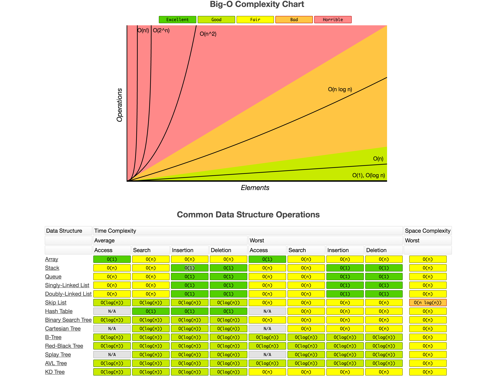
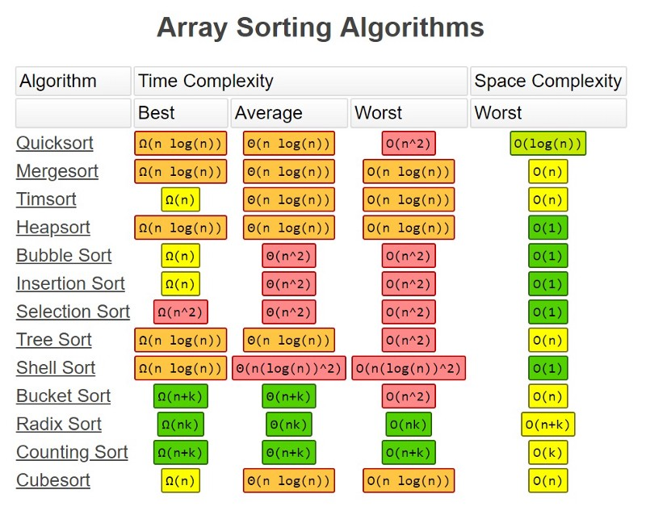

# A Practical Guide to Algorithms with JavaScript

## Space Complexity

How much `memory` used?

## Time Complexity

How many primitive `operations` are executed?

...with respect to input size

...and assuming worst case scenarios

| Big-O, name       | # of Operations | Algorithm                        |
| ----------------- | --------------- | -------------------------------- |
| O(n^2), quadratic | n^2             | Compare all numbers              |
| O(n), linear      | 2n              | Find min and max numbers         |
| O(1), constant    | 2               | Sorted list, find first and last |

## Big-O Complexity Chart

