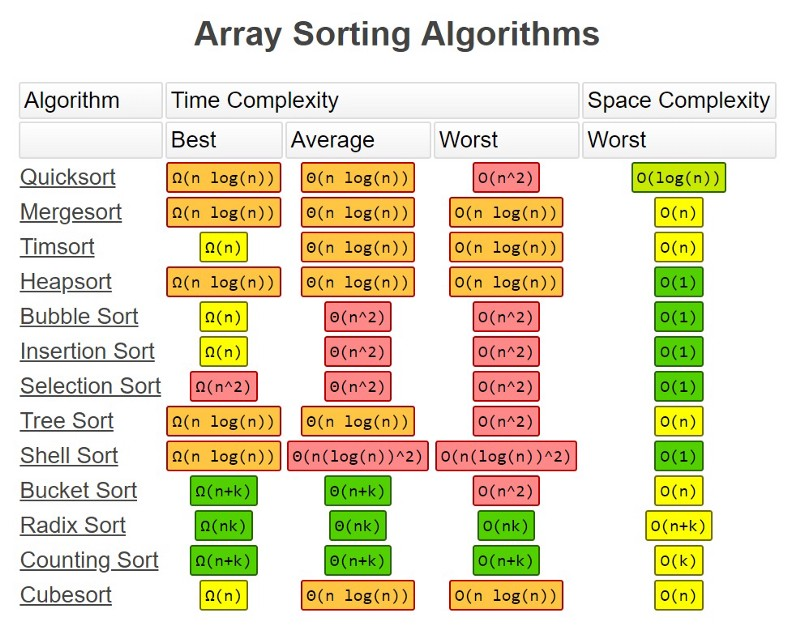

# A Practical Guide to Algorithms with JavaScript

## Space Complexity

> How much `memory` used?

## Time Complexity

> How many primitive `operations` are executed?

## Optimization with Caching

- [isUnique](./Optimization/isUnique.js)
- [uniqSort](./Optimization/uniqSort.js)
- [memorization](./Optimization/memoization.js)

## Recursion

- [joinElements](./Recursion/joinElements.js)
- [factorial](./Recursion/factorial.js)

## Divide & Conquer

- [Linear Search](./Divide-and-Conquer/linearSearch.js)
- [Binary Search](./Divide-and-Conquer/binarySearch.js)

## Big-O Complexity Chart

